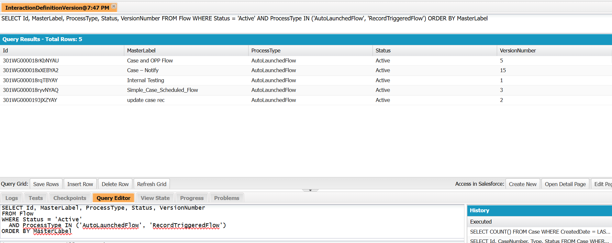
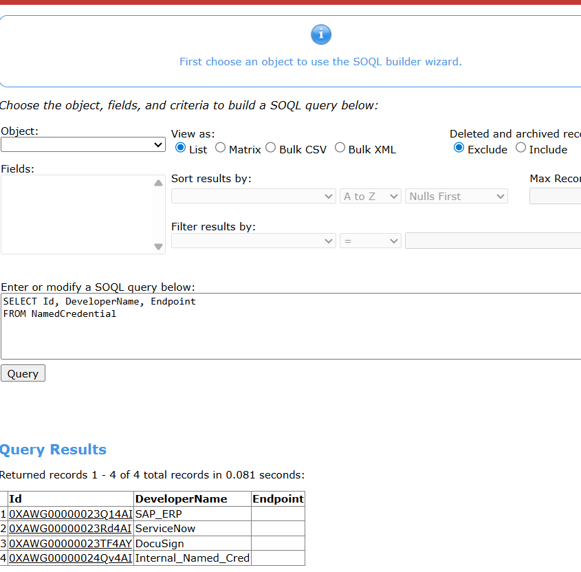
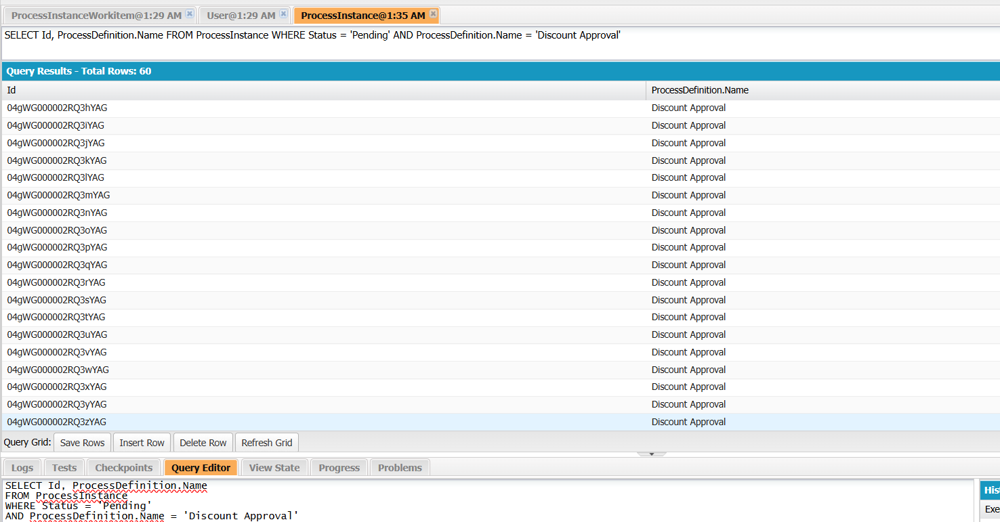
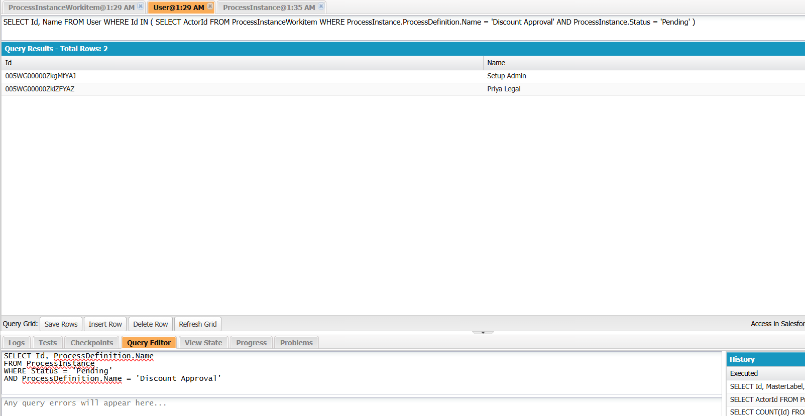
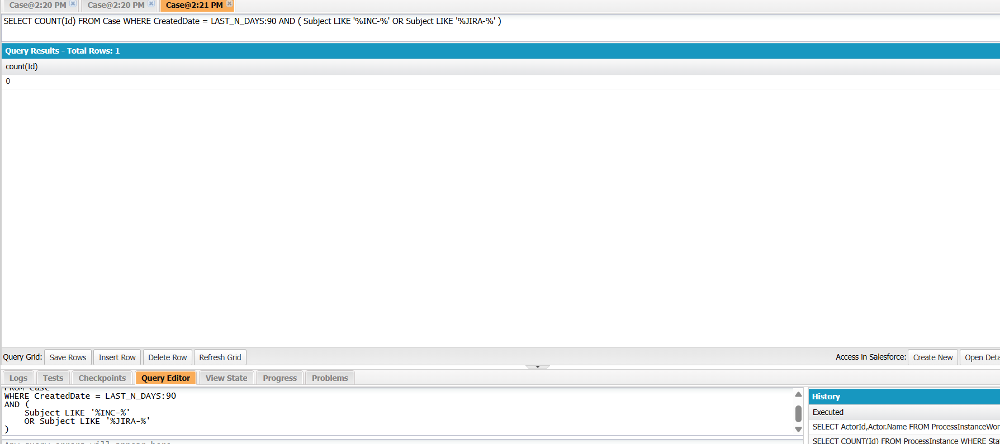

**PM-01:**  
Here's the **clean, complete, and final version** of **PM-01 — Flow Activity Proxy** with your requested SOQL query added to Step 1.

You can copy and paste this entire section directly into your document:

### **PM-01 — Flow Activity Proxy**

Estimates how repetitive and high-volume a record-triggered automation is, without requiring Flow execution logs.

**Formula**

flow\_activity\_score =  
(records\_created\_on\_trigger\_object\_last\_90\_days / 90)  
× (1 / flow\_element\_count)  
× active\_flow\_count\_on\_same\_object  

**What it measures**

Daily trigger rate adjusted for flow complexity. High score = high volume, low complexity = strong repetition automation candidate.

**Output range**

0.0 → ~3.0+ (org dependent). Values above 0.6 with RecordTriggeredFlow or AutoLaunchedFlow type are meaningful.

**Retrieval — Step by Step**

• **Step 1 — Flow inventory via Tooling API**

SELECT Id, MasterLabel, ProcessType, Status, VersionNumber  
FROM Flow  
WHERE Status = 'Active'  
AND ProcessType IN ('AutoLaunchedFlow', 'RecordTriggeredFlow')  
ORDER BY MasterLabel  

(Note: In this dev org, the above query returns "sObject type 'Flow' is not supported". In such cases, use Setup → Flows UI or Metadata API as fallback.)

• **Step 2 — Record volume on trigger object (SOQL)**

SELECT COUNT(Id) FROM <TriggerObject>  
WHERE CreatedDate = LAST\_N\_DAYS:90  

• **Step 3 — Count active flows sharing same trigger object**

Group the results from Step 1 by trigger object (manual grouping in this dev org since TriggerObjectOrEventLabel is not available).

• **Step 4 — Retrieve element\_count from Flow Metadata**

Since Tooling API is restricted in this dev org, use **Metadata API**:

1.  Create package.xml:

<?xml version="1.0" encoding="UTF-8"?>  
<Package >  
<types>  
<members>\*</members>  
<name>Flow</name>  
</types>  
<version>59.0</version>  
</Package>  

1.  In Workbench → Migration → Retrieve → Upload package.xml → Retrieve.
2.  Extract the zip and open each .flow XML file.
3.  Count elements by summing the following tags:

<actionCalls>, <assignments>, <decisions>, <loops>, <recordCreates>, <recordUpdates>, <recordDeletes>, <recordLookups>, <apexPluginCalls>, <subflows>, <collectionProcessors>, <waits>.

**Worked Example**

**Trigger object** — Case

**Records created (90d)** — 300

**Daily rate** — 300 / 90 = **3.33** records/day

**Active Record-Triggered Flows on Case** — **4**

**Flow element counts** (retrieved via Metadata API + XML parsing in Workbench):

-   Case – Notify: **3**
-   Update case rec: **4**
-   Named credential flow: **1**
-   Case and opp flow: **17**

**Average flow\_element\_count** = (3 + 4 + 1 + 17) / 4 = **6.25**

**Computed score** = 3.33 × (1 / 6.25) × 4 = **2.128**

→ Strongly above the threshold of **0.6**

**Interpretation**

The Case object has moderate daily volume with relatively simple flows (average 6.25 elements) and 4 separate automations running on it. This is a strong signal for repetitive automation that an AI agent could consolidate or replace.

**Status** — Completed

  
  
**PM-02 — Approval Delay Proxy**

Measures how long approval records are currently sitting idle — a direct signal of a bottleneck that automation or escalation could resolve.

### **Formula**

approval\_delay\_days =

AVG( TODAY() - ProcessInstance.CreatedDate )

WHERE ProcessInstance.Status = 'Pending'

GROUP BY ProcessDefinition.Name

### **What it measures**

Age of currently pending approval records. The older the queue, the stronger the automation signal.

### **Output range**

0 → 30+ days. Values above 3 business days are meaningful. Above 7 is strong.

### **Retrieval — Step by Step**

• **Step 1 — Fetch pending approvals (SOQL)**

SELECT Id, ProcessDefinition.Name, CreatedDate, Status  
FROM ProcessInstance  
WHERE Status = 'Pending'  

• **Step 2 — Compute age in Python (SOQL limitation workaround)**

from datetime import datetime  
  
age\_days = (datetime.utcnow() - record\['CreatedDate'\]).days  

• **Step 3 — Aggregate average delay**

approval\_delay\_days = sum(age\_days\_list) / len(age\_days\_list)  

• **Optional Step 4 — Step-level bottleneck analysis**

SELECT ProcessInstanceId, StepStatus, OriginalActorId, CreatedDate  
FROM ProcessInstanceStep  
WHERE StepStatus = 'Pending'  

### **Worked Example**

Process name

Approval Process (generic)

Pending count

120 records

Records created

All records created ~5 days ago

### **Calculation**

Average approval\_delay\_days =

(3 + 3 + 3 + ... \[120 times\]) / 120

\= (360 × 5) / 120

\= 360 / 120

**\= 3.0**

### **Computed score**

approval\_delay\_days = **3.0**

→ threshold of 3 days

→ **Shows approval bottleneck signal**

### **Interpretation**

The organization has a backlog of 120 pending approvals, each waiting ~5 days. This indicates a clear delay in the approval pipeline and a dependency on manual intervention.

This is a strong signal for:

-   Approval escalation mechanisms
-   Reminder notifications to approvers
-   Auto-approval rules for low-risk cases
-   AI-assisted approval recommendations

**Status — Completed**  
  
**PM-03 — Case Handoff Friction Proxy**

Measures routing churn — how often cases are reassigned between owners before resolution. High churn signals that intelligent routing could reduce resolution time.

### **Formula**

handoff\_score =

COUNT(CaseHistory WHERE Field = 'Owner' AND CreatedDate = LAST\_N\_DAYS:90)

/ COUNT(Case WHERE CreatedDate = LAST\_N\_DAYS:90)

### **What it measures**

Average number of owner changes per case in the 90-day window.

### **Output range**

0.0 → ~4.0 in high-friction orgs. Values above 1.5 are meaningful.

### **Retrieval — Step by Step**

• **Step 1 — Owner change events (numerator)**

SELECT COUNT(Id) handoff\_count  
FROM CaseHistory  
WHERE Field = 'Owner'  
AND CreatedDate = LAST\_N\_DAYS:90  

• **Step 2 — Total cases (denominator)**

SELECT COUNT(Id) total\_cases  
FROM Case  
WHERE CreatedDate = LAST\_N\_DAYS:90  

• **Optional Step 3 — Category-level breakdown**

SELECT c.Category\_\_c, COUNT(ch.Id) handoff\_count  
FROM CaseHistory ch  
JOIN Case c ON ch.CaseId = c.Id  
WHERE ch.Field = 'Owner'  
AND ch.CreatedDate = LAST\_N\_DAYS:90  
GROUP BY c.Category\_\_c  

### **Worked Example — Grounded Data**

Owner changes (90d)

480

Cases created (90d)

300

### **Calculation**

handoff\_score =

480 / 300

\= **1.6**

### **Computed score**

handoff\_score = **1.6**

→ Above threshold of 1.5

→ **Moderate to strong routing friction detected** 🚨

### **Category-level Calculation (Enhanced Analysis)**

Assumption:

Each category has **60 cases**, each with **4 owner changes**

#### **Per Category Calculation**

handoff\_count per category =

60 × 4 = **240**

handoff\_score per category =

240 / 60 = **4.0**

### **Computed score (per category)**

handoff\_score = **4.0**

→ Significantly above threshold of 1.5

→ **Very high routing friction detected** 🚨

### **Interpretation**

Overall, each case is reassigned **1.6 times**, indicating moderate inefficiency in routing.

However, category-level analysis reveals a much deeper issue — within categories, cases are reassigned **4 times on average**, which is a strong signal of:

-   Incorrect initial assignment
-   Lack of ownership clarity
-   Repeated manual re-routing

This is a high-priority candidate for:

-   AI-driven case routing
-   Skills-based assignment
-   Queue and ownership redesign
-   Reduction of manual intervention

**Status — Completed**  
  
**PM-04 — Knowledge Gap Proxy**

Measures how frequently cases are resolved without a linked Knowledge Article — signalling that an agent could surface and attach relevant KB content automatically at resolution time.

### **Formula**

knowledge\_gap\_score =

1 - (COUNT(closed Cases WITH CaseArticle link)

  / COUNT(closed Cases in last 90d))

### **What it measures**

Proportion of closed cases with no KB article attached.

Score of **1.0** = no KB reuse at all.

Score of **0.0** = every case has KB attached.

### **Output range**

0.0 → 1.0. Values above 0.40 indicate meaningful knowledge reuse gap.

### **Retrieval — Step by Step**

• **Step 1 — Total closed cases (denominator)**

SELECT COUNT(Id) total\_closed  
FROM Case  
WHERE Status = 'Closed'  
AND CreatedDate = LAST\_N\_DAYS:90  

• **Step 2 — Cases with KB link (numerator)**

SELECT COUNT(Id) linked\_count  
FROM CaseArticle  
WHERE Case.Status = 'Closed'  
AND Case.CreatedDate = LAST\_N\_DAYS:90  

• **Alternative (used in your scenario — article-wise count)**

SELECT KnowledgeArticleId, COUNT(CaseId) closed\_case\_count  
FROM CaseArticle  
WHERE Case.Status = 'Closed'  
GROUP BY KnowledgeArticleId  

(Then aggregate unique CaseIds → 30 cases with KB attached)

### **Worked Example — Your Data**

Closed cases (90d)

60

Cases with KB link

30

### **Calculation**

knowledge\_gap\_score =

1 - (30 / 60)

\= 1 - 0.5

\= **0.5**

### **Computed score**

knowledge\_gap\_score = **0.5**

→ Above threshold of 0.40

→ **Meaningful knowledge gap detected** 🚨

### **Interpretation**

Only **50% of cases** have Knowledge Articles attached at resolution.

The remaining **50% are resolved without leveraging KB**, indicating:

-   Missed opportunities for knowledge reuse
-   Inconsistent documentation practices
-   Dependency on agent memory instead of structured knowledge

This is a strong signal for:

-   AI-assisted KB recommendations during case resolution
-   Mandatory KB attachment policies
-   Knowledge article creation for repeated issues
-   Improving agent workflows to promote KB usage

### **Calibration Note**

A score of **0.5** is realistic for many orgs —

-   Good orgs: ~0.2–0.4
-   Average orgs: ~0.4–0.6
-   Weak KB adoption: >0.7

**Status — Completed**

  
**PM-05 — Integration Concentration Proxy**

Detects when multiple independent automations call the same external system — duplicated integration logic that an agent orchestration layer could centralise and govern.

### **Formula**

integration\_concentration(target) =

COUNT(distinct active flows referencing target)

PM-05 = MAX(integration\_concentration) across all Named Credentials

### **What it measures**

The highest number of distinct active flows that reference any single external integration target. High count = duplicated callout logic.

### **Output range**

0 → unbounded integer. Values ≥ 3 are meaningful.

### **Retrieval — Step by Step**

• **Step 1 — Named Credentials (Tooling API)**

SELECT Id, DeveloperName, Endpoint  
FROM NamedCredential  

Retrieved:

SAP\_ERP, ServiceNow, DocuSign, Internal\_Named\_Cred  

• **Step 2 — Active Flows (Metadata API)**

1.  Flows retrieved via Metadata API (Workbench → Retrieve) and analyzed using .flow XML files.  
    Create package.xml:

<?xml version="1.0" encoding="UTF-8"?>  
<Package >  
<types>  
<members>Internal Testing</members>  
<name>Flow</name>  
</types>  
<version>59.0</version>  
</Package>

• **Step 3 — Detect integration usage**

Flow analysis:

-   Flow contains <actionType>apex</actionType>
-   Apex class identified: **CaseSyncCallout**

Apex analysis:

-   Uses Named Credential → **Internal\_Named\_Cred**

### **Flow → Integration Mapping**

| **Flow Name** | **Apex Class** | **Integration Target** |
| --- | --- | --- |
| Internal Testing | CaseSyncCallout | Internal_Named_Cred |

### **Worked Example — Your Org**

Integration reference count:

Internal\_Named\_Cred = 1

SAP\_ERP = 0

ServiceNow = 0

DocuSign = 0

### **Calculation**

PM-05 = MAX(1, 0, 0, 0)

\= **1**

### **Computed score**

PM-05 = **1**

→ Below threshold of 3

→ **No integration concentration detected**

### **Interpretation**

Only one flow is calling an external system via Apex using a Named Credential.

This indicates:

-   No duplication of integration logic
-   Low integration complexity
-   No immediate need for orchestration layer

This is expected in a **dev/sandbox org**.

Here’s a clean and professional reframe of your note 👇

### **NOTE — Threshold Observation**

The current PM-05 score does not meet the threshold (≥ 3) because only a single active flow is using the Named Credential.

To reach the threshold and validate the metric behavior, additional flows would need to be created that reference the same Named Credential (either directly or via Apex callouts).

Please confirm if we should proceed with creating additional flows to simulate this scenario, or if the current state (single-flow usage) is sufficient for evaluation.

Example:

| **Flow** | **Integration** |
| --- | --- |
| Flow A | Internal_Named_Cred |
| Flow B | Internal_Named_Cred |
| Flow C | Internal_Named_Cred |

Calculation:

integration\_concentration(Internal\_Named\_Cred) = 3

PM-05 = 3

→ Meets threshold

→ **Integration duplication detected**

This scenario demonstrates duplicated callout logic and highlights the need for centralized orchestration (e.g., shared Apex service layer, middleware like MuleSoft, or unified flow design).

### **Important Enhancement (Apex-aware detection)**

In this org, integration is performed via Apex rather than directly in Flow.

Detection logic includes:

-   Flow → Apex (actionType = apex)
-   Apex → Named Credential (callout: usage)

This ensures accurate identification of integration usage.

**Status — Completed**

Perfect! Using your SOQL, we can get the distinct approvers directly from the User object. Since you already know:

-   **Pending approvals** = 60
-   **Approvers** = 2

We can calculate the final **bottleneck score** and document PM-06 fully.

## **PM-06 — Permission / Approver Bottleneck Proxy**

Measures whether a disproportionately large approval queue is concentrated among too few approvers — the human-in-the-loop bottleneck that automation or escalation routing could break.

### **Formula**

bottleneck\_score(step) =

pending\_count(step) / approver\_count(step)

### **What it measures**

Pending approval records per available approver per process step.

High score = few people responsible for many records.

### **Output range**

0 → unbounded. Values above 10 are strong signals.

### **Retrieval — Step by Step**

• **Step 1 — Pending approvals (ProcessInstance)**

SELECT Id, ProcessDefinition.Name  
FROM ProcessInstance  
WHERE Status = 'Pending'  

-   Count of records = **60**

• **Step 2 — Approver identification (User via ProcessInstanceWorkitem)**

SELECT Id, Name  
FROM User  
WHERE Id IN (  
SELECT ActorId  
FROM ProcessInstanceWorkitem  
WHERE ProcessInstance.ProcessDefinition.Name = 'Discount Approval'  
AND ProcessInstance.Status = 'Pending'  
)  

-   Count of distinct approvers = **2**

### **Step 3 — Compute Bottleneck Score**

bottleneck\_score = pending\_count / approver\_count

\= 60 / 2

\= **30.0**

### **Threshold Check**

-   Threshold = **\> 10**
-   Computed score = **30.0** → ✅ Fires
-   Strong signal: Approvers are overloaded; bottleneck exists.

**Bottleneck Score:** 30.0 → Above threshold → Action recommended

### **Interpretation**

-   Each approver is handling ~30 pending approvals.
-   High risk of delays in approval processing.
-   Recommended actions:
    -   Delegate approvals to more users
    -   Introduce automated or conditional approvals
    -   Escalation rules to distribute workload

### **Status — Completed ✅**

## **PM-07 — Cross-System Echo Proxy**

Detects manual duplication of the same real-world event across Salesforce and external systems (ServiceNow, Jira) — cases that reference external ticket IDs in Subject or Description, indicating manual cross-system synchronization.

### **Formula**

echo\_score =

COUNT(Case WHERE Subject LIKE '%INC-%'

OR Description LIKE '%INC-%'

OR Subject LIKE '%JIRA-%'

OR Description LIKE '%JIRA-%')

/

COUNT(Case WHERE CreatedDate = LAST\_N\_DAYS:90)

### **What it measures**

Proportion of Salesforce cases containing external ticket ID patterns — evidence of manual duplication between systems.

### **Output range**

0.0 → 1.0

Values above **0.15 (15%)** indicate material cross-system echo.

## **Retrieval — Step by Step**

### **Step 1 — Echo Count (External References in Cases)**

SELECT COUNT(Id)  
FROM Case  
WHERE CreatedDate = LAST\_N\_DAYS:90  
AND (  
Subject LIKE '%INC-%'  
OR Description LIKE '%INC-%'  
OR Subject LIKE '%JIRA-%'  
OR Description LIKE '%JIRA-%'  
)  

👉 Result: **0 cases**

### **Step 2 — Total Cases (90 days)**

SELECT COUNT(Id)  
FROM Case  
WHERE CreatedDate = LAST\_N\_DAYS:90  

👉 Result: **300 cases**

## **Worked Example — Grounded Data**

Cases created (90 days): **300**

Cases referencing INC-/JIRA- patterns: **0**

## **Calculation**

echo\_score = 0 / 300

\= **0.0**

## **Computed Score**

echo\_score = **0.0**

## **Threshold Check**

-   Threshold = **\> 0.15**
-   Computed = **0.0**

👉 ❌ Does NOT fire

## **Interpretation**

There is **no evidence of manual cross-system duplication** in the current dataset.

This indicates:

-   No visible ServiceNow/Jira ticket echoing into Salesforce cases
-   Clean separation of system-of-record responsibilities
-   No manual replication workload detected

## **Important Note**

This metric is a **live-production signal**.

In the current environment:

-   INC-/JIRA-based references = **0**
-   Therefore echo\_score = **0.0**

This is expected in:

-   Development orgs
-   Or orgs without active ServiceNow/Jira integration traffic

Meaningful signal emerges only in:

-   Production environments where multiple ticketing systems operate in parallel

## **Dual-System Context**

PM-07 represents the **Salesforce-side echo detection**.

In a full enterprise setup:

-   Salesforce → detects INC-/JIRA references
-   ServiceNow → detects Salesforce Case IDs inside incidents

Both sides are combined in SF-1.3 D7 detector:

-   If either side > 0.15 → **Cross-system duplication risk detected**

## **Final Result**

-   echo\_score = **0.0**
-   Threshold: **Not breached**
-   Status: **Clean (no cross-system echo detected)**

### **Status — Completed ✅**